# ⚡ Electrician Contractor Management System

A full-stack web application designed to manage electricians, contractors, and job workflows efficiently.
It includes authentication, task tracking, notifications, and dashboard analytics.

---

## 🚀 Features

* 🔐 JWT-based Authentication (Login / Register)
* 👷 Electrician Management
* 📋 Job Assignment & Tracking
* ✅ Task Management System
* 🔔 Notification System (Role-based)
* 📊 Dashboard with Real-time Statistics

---

## 🛠️ Tech Stack

### 🔹 Backend

* Django
* Django REST Framework
* SimpleJWT

### 🔹 Frontend

* HTML
* CSS
* Bootstrap
* JavaScript

### 🔹 Database

* SQLite

---

## 📸 Screenshots

### 🏠 Home Page

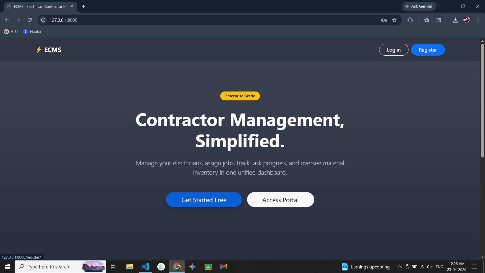

### 🔐 Login Page


### 📝 Register Page


---

### 📊 Dashboard

#### Admin Dashboard

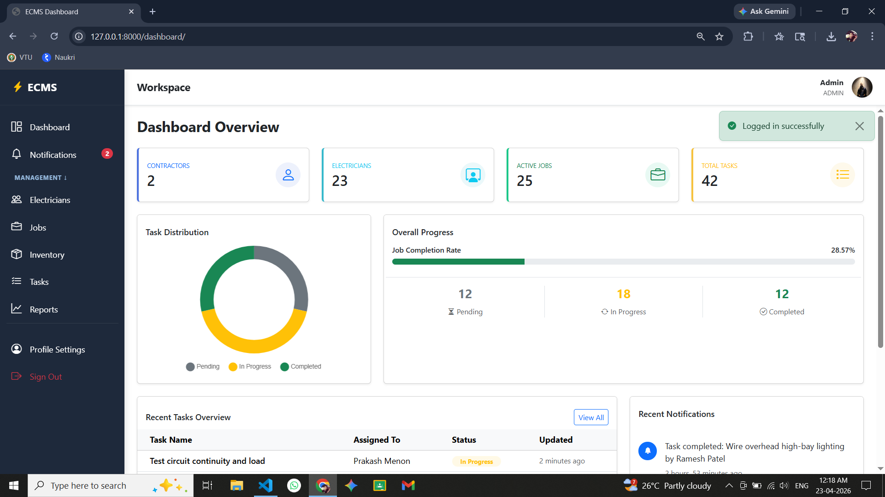

#### Electrician Dashboard

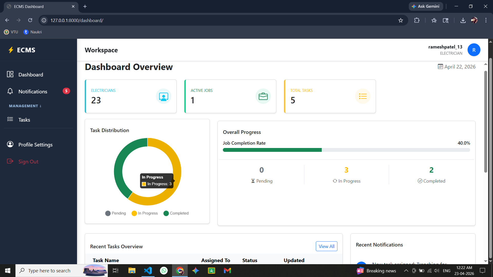

---

### 👷 Electricians Page


---

### 👷 View as Electrician

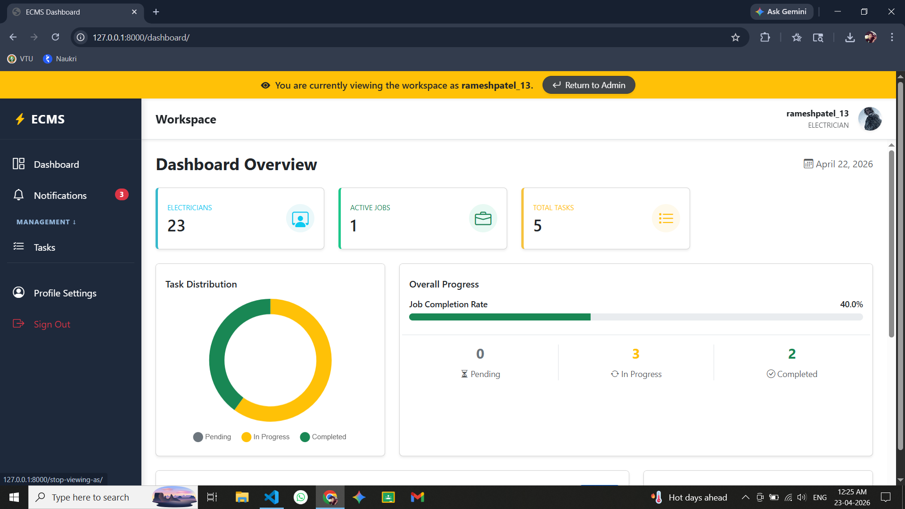

---

### 💼 Jobs Page


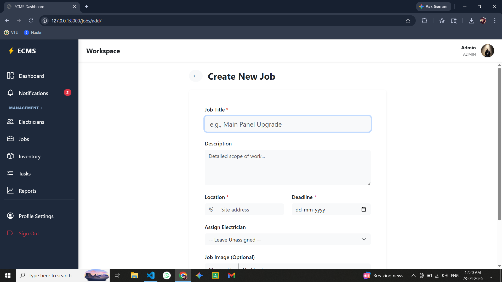

---

### ✅ Tasks Page

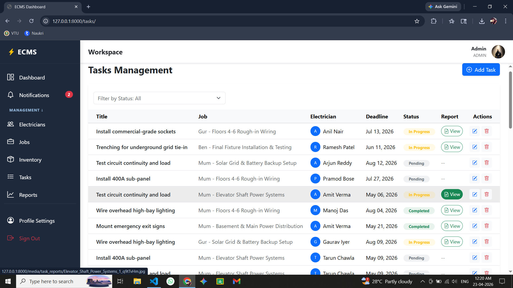
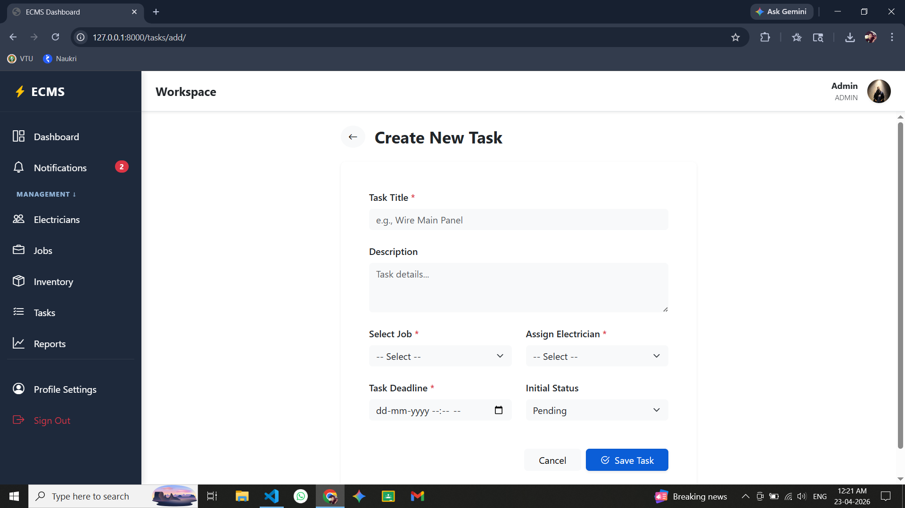
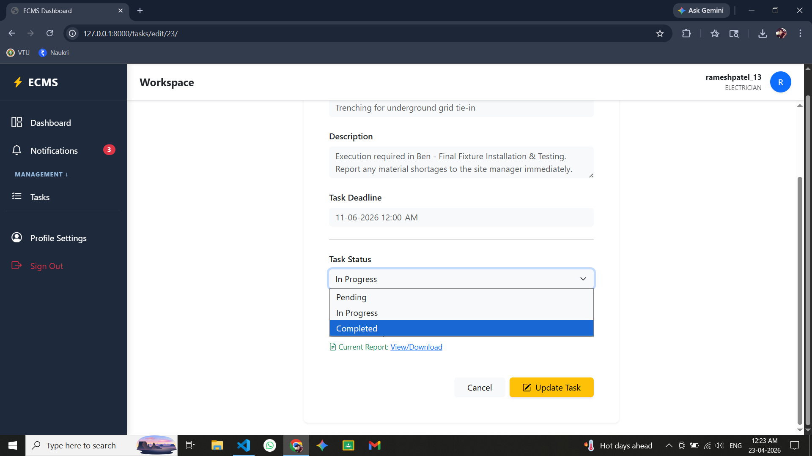
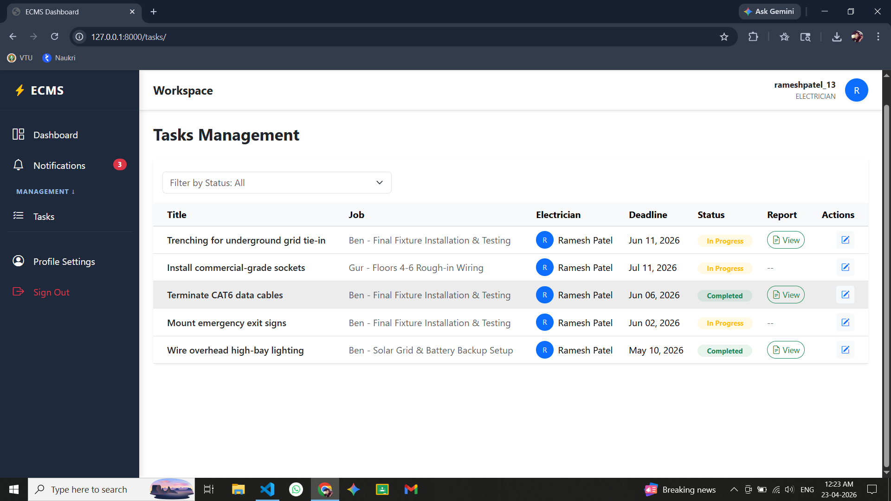

---

### 🔔 Notification Page

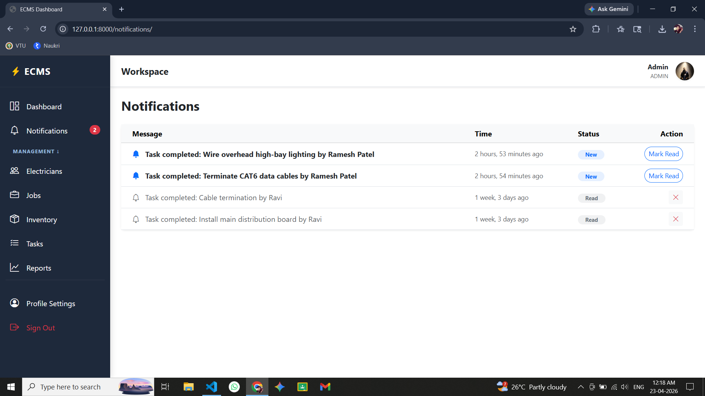
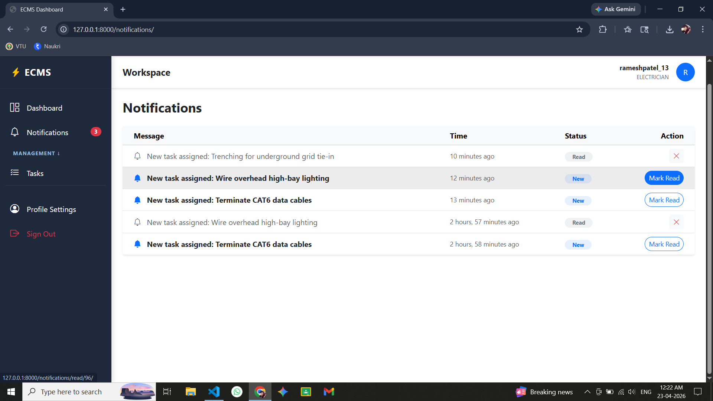

---

### 📈 Reports Page

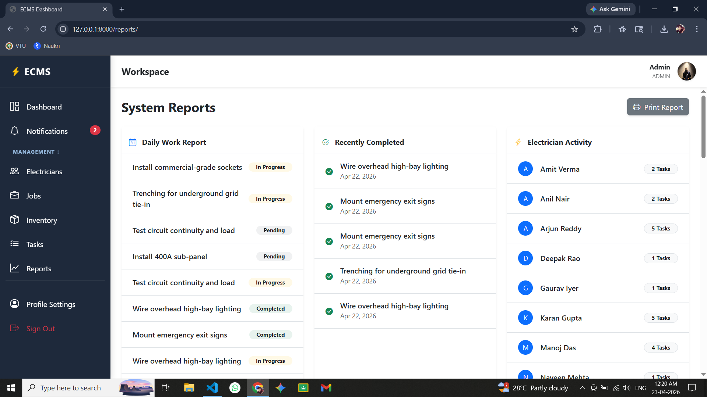

---

### 👤 Profile Page

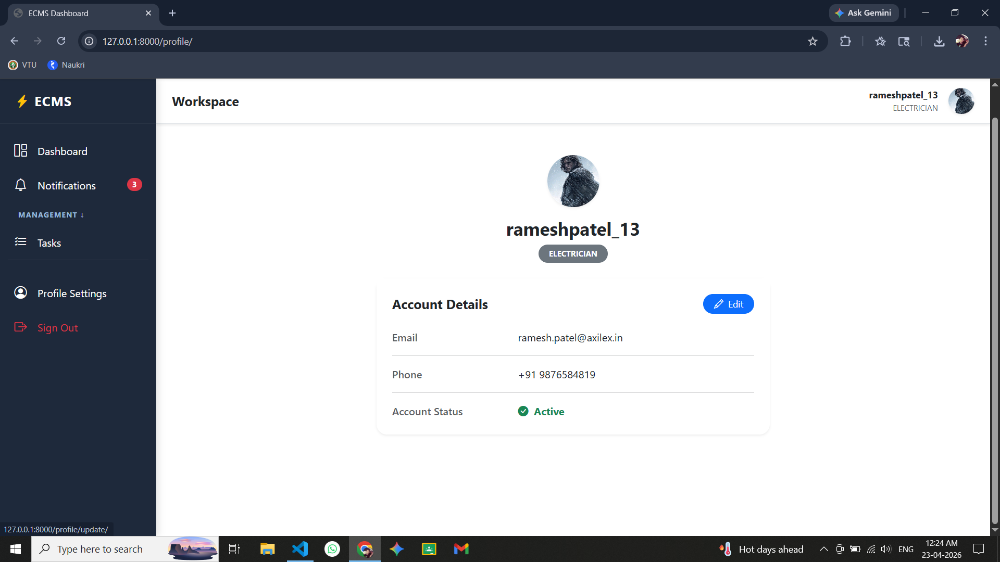

---

## ⚙️ Installation & Setup

### 1️⃣ Clone Repository

```bash
git clone https://github.com/Pavankumar1299/Electrician-Contractor-Management-System.git
cd Electrician-Contractor-Management-System/backend
```

---

### 2️⃣ Create Virtual Environment

```bash
python -m venv venv
venv\Scripts\activate
```

---

### 3️⃣ Install Dependencies

```bash
pip install -r requirements.txt
```

---

### 4️⃣ Apply Migrations

```bash
python manage.py migrate
```

---

### 5️⃣ Run Server

```bash
python manage.py runserver
```

---

## 🔑 Authentication (JWT)

After login, you will receive a JWT token.

Use it in requests:

```
Authorization: Bearer <your_token>
```

---

## 🎯 Future Improvements

* 🔔 Real-time notifications (WebSockets)
* 📱 Responsive UI enhancements
* ☁️ Deployment (AWS / Render)
* 📊 Advanced analytics dashboard
* 🔒 Improved role-based permissions

---

⭐ If you like this project, consider giving it a star on GitHub!
