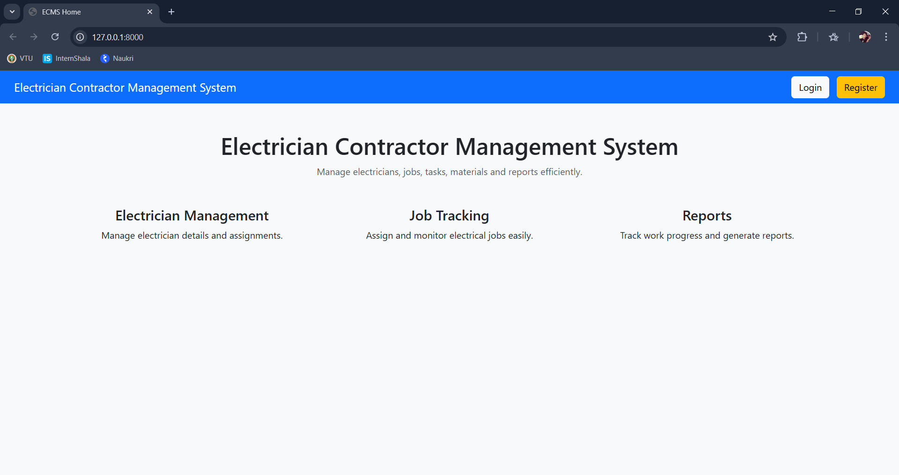
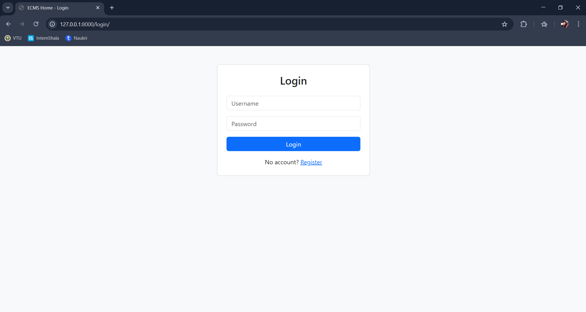
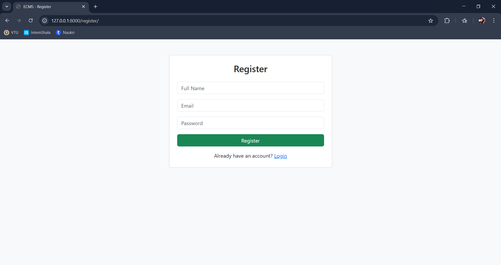
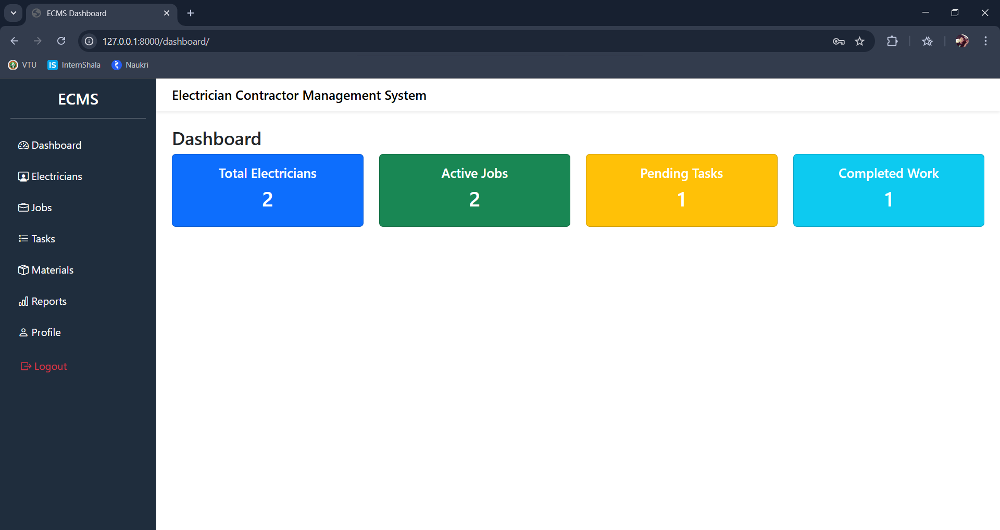
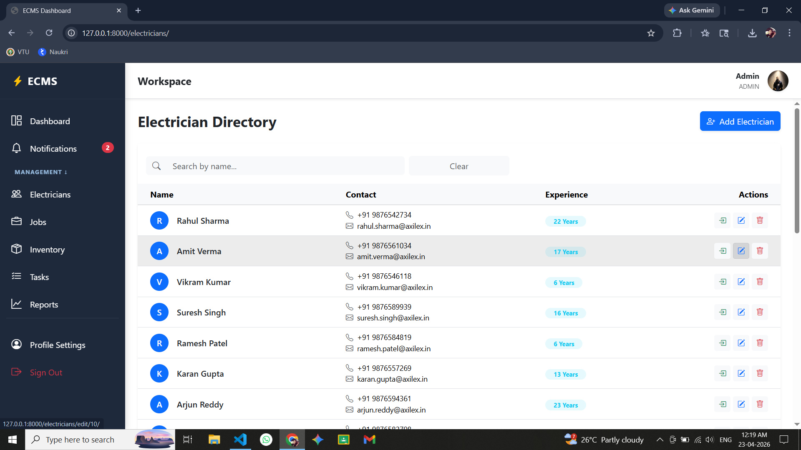
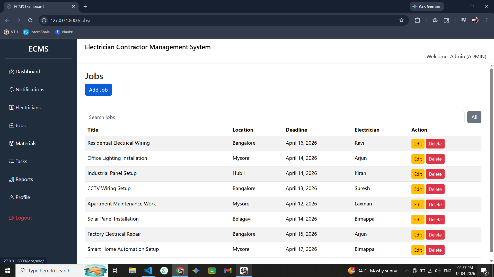

# Electrician Contractor Management System

A full-stack web application to manage electricians, contractors, and job workflows efficiently. It provides authentication, job tracking, and dashboard analytics.

---

## Features

* 🔐 User Authentication (JWT आधारित login/register)
* 👷 Electrician Management
* 📋 Job Assignment & Tracking
* 📊 Dashboard with statistics
* ✅ Task Management

---

## 🛠️ Tech Stack

**Backend**

* Django
* Django REST Framework
* SimpleJWT

**Frontend**

* HTML, CSS, Bootstrap
* JavaScript

**Database**

* MySQL

---

## 📸 Screenshots


### Home Page



### Login Page



### Register Page



### Dashboard



### Electricians Page



### Jobs Page



---

## ⚙️ Installation & Setup

### 1. Clone Repository

```bash
git clone https://github.com/Pavankumar1299/Electrician-Contractor-Management-System.git
cd Electrician-Contractor-Management-System/backend
```

### 2. Create Virtual Environment

```bash
python -m venv venv
venv\Scripts\activate
```

### 3. Install Dependencies

```bash
pip install -r requirements.txt
```

### 4. Apply Migrations

```bash
python manage.py migrate
```

### 5. Run Server

```bash
python manage.py runserver
```

---

## 🔑 Authentication (JWT)

After login, you will receive a token.

Use it in requests:

```
Authorization: Bearer <your_token>
```


---

## 🎯 Future Improvements

* Role-based access (Admin/User)
* Notifications system
* Deployment (AWS / Render)
* UI enhancements
